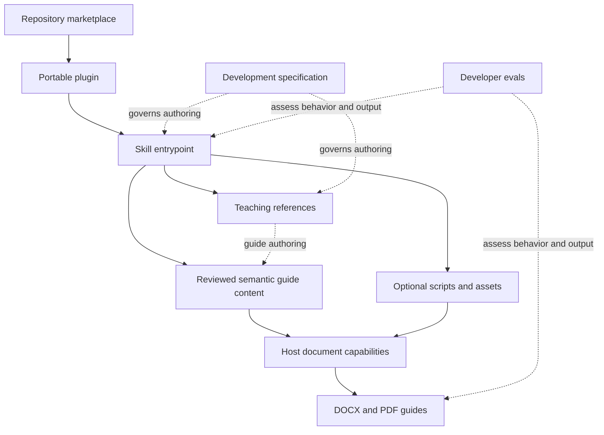

# Repository architecture

## Boundaries

One repository marketplace catalogs independently installable plugins. Each plugin
owns its portable manifest and runtime skill resources. Adding another plugin means
adding `plugins/<plugin-name>/` and a catalog entry, without restructuring this repo.

Phase 2 implements teaching; Phase 3 adds the versioned model, shared content plan,
DOCX/direct-PDF helpers, and mechanical plus PDF visual inspection. Full behavioral
and clean-host release validation remain Phase 4.

| Layer | Location | Responsibility |
| --- | --- | --- |
| Marketplace | `.agents/plugins/marketplace.json` | Discovery, labels, sources, and installation/authentication policies. |
| Plugin | `plugins/cufe-study-guide/plugin.json` | Stable identity, development version, publisher, and host presentation. |
| Skill | `plugins/cufe-study-guide/skills/cufe-study-guide/SKILL.md` | Precise activation description, purpose, essential workflow, and reference routing. |
| References | Skill `references/` | Operational portable teaching decisions, conditional features, and content QC. |
| Helpers | Skill `scripts/` and `assets/` | Baseline shared-model renderers, isolated bootstrap/lock, schema and semantic theme. |
| Specifications | `docs/specs/` | Development requirements and acceptance criteria; excluded from runtime requirements. |
| Evals | `evals/cufe-study-guide/` | Future developer cases, fixtures, graders, and repair loop; not runtime dependencies. |

Distribute the plugin directory, including its references and required
helpers. Installation must not need files above that directory. Do not duplicate
the skill under `.agents/skills/` merely to activate it during development.

## Standards verified on 2026-10-01

The current [OpenAI packaging guide](https://developers.openai.com/plugins/build/plugins)
uses root `plugin.json` with the Agent Plugins 1.0.0 schema and discovers root
`skills/` automatically. OpenAI presentation belongs in `extensions.com.openai`.
The `.codex-plugin/plugin.json` scaffold is a supported compatibility fallback;
this project uses the portable format without that duplicate.

The same guide locates repo catalogs at `.agents/plugins/marketplace.json` and
resolves `./` source paths from the marketplace root (this repository), not the
catalog's directory. Our first entry uses `./plugins/cufe-study-guide`,
`AVAILABLE`, and `ON_USE`.

The downloaded [manifest schema](https://agent-plugins.org/schemas/1.0.0/plugin.schema.json)
rejects undeclared root properties and permits omitting `license`. No marketplace
schema URL is declared: the packaging guide supplies the catalog contract, and
the official Codex types and CLI supply additional validation evidence.

The guide supports GitHub shorthand marketplace sources. A future README can
center on `codex plugin marketplace add omar13Hamdy37/OHamdy-agent-skills`.
Phase 4 will test the complete user installation flow.

The authentication enum was checked in official
[Codex marketplace types](https://github.com/openai/codex/blob/d91294c39edb93d204926b33f21310dc968edc34/codex-rs/core-plugins/src/marketplace.rs)
and its generated
[protocol schema](https://github.com/openai/codex/blob/d91294c39edb93d204926b33f21310dc968edc34/codex-rs/app-server-protocol/schema/json/v2/PluginListResponse.json):
only `ON_INSTALL` and `ON_USE` are supported. `ON_USE` defers connection
authentication; this skills-only package declares no service or account to
authenticate. Do not invent `NONE`, `noauth`, or OAuth configuration here.

[OpenAI's skill guidance](https://learn.chatgpt.com/docs/build-skills) requires
`name` and `description`, supports progressive disclosure, and treats scripts,
references, assets, and UI metadata as optional. The entrypoint is authored
manually to avoid unrelated initializer artifacts; `agents/openai.yaml` is not
needed in this phase.

## Host portability and availability

[ChatGPT plugin documentation](https://learn.chatgpt.com/docs/plugins) describes
supported ChatGPT/Work surfaces and Codex CLI plugin browsing; it currently says
plugins are unavailable in the IDE extension. Repository marketplace availability
must be checked per surface. Portable packaging does not establish that every
host can install this repo or produce both formats.

Our design keeps teaching intelligence in instructions and references. Codex can
use local document tools; supported Work environments can use native artifact
capabilities. Later generation helpers must preserve the same learning decisions
and expose unavailable output capabilities honestly.

## Deliberate Phase 1 choices

- No structural change from the requested portable layout was necessary.
- Add `.gitattributes` to enforce LF for tracked text on Windows.
- Keep one catalog for future plugins and leave installation optional.
- Use `0.1.0` as a development version, with explicit scaffold status in listing
  metadata and documentation. There is no release tag or publication.
- Omit license, MCP wiring, hooks, local enablement configuration, final templates,
  dependency manifests, and installer code.
- Keep the v1 specification authoritative during development. Phase 2 must move
  complete operational behavior into references before release, so an installed
  package remains self-contained.

## Phase 2 instruction architecture

Current guidance was rechecked on 2026-10-01. The
[OpenAI skills page](https://learn.chatgpt.com/docs/build-skills) confirms description-
based selection and progressive disclosure. The
[plugin skill authoring guide](https://developers.openai.com/plugins/build/skills)
recommends concise entrypoints, explicit resource routing, and scripts only when
they add reliable computation/file processing. No packaging change was required.

`SKILL.md` orchestrates intake, evidence inspection, concept mapping, selection,
teaching, revision features, QC, and output handoff. The four core references are
consulted at their stages; conditional references are loaded only when their
decision is relevant. All runtime links remain within the plugin.

`content-selection.md` owns intake/preferences, the concept/dependency model,
five content categories, provenance, and the coverage ledger. `teaching-style.md`
owns discipline adaptation and content-level treatment of equations, diagrams,
code, and tables. Conditional references own prior retrieval, breaks, proofs,
quizzes, and cheatsheets. `quality-checklist.md` reviews content; `document-design.md`
defines semantic types and associations to preserve during later export.

The content contract accepts readable labeled content or an equivalent host-native
structure; it is not a new manifest schema or mandatory serialization dependency.
Course/enrichment provenance and semantic block type are separate. Rendering may
change presentation, but must preserve explanations, object meaning, answer
separation, and intact conceptual groups.

No new scripts, assets, dependencies, or eval implementations were introduced.
`0.1.0` remains a development version, not a release. Phase 1's validation record
is historical; the [Phase 2 record](validation-phase2.md) documents current checks.

## Phase 3 rendering architecture

Guidance rechecked across 2026-10-01/02: the
[portable packaging guide](https://developers.openai.com/plugins/build/plugins)
still uses the existing root manifest, and
[skill resources](https://developers.openai.com/plugins/build/skills) remain
package-contained scripts/assets/references. No packaging/discovery change or hook
was required. The documented `agents/openai.yaml` dependencies concern tools;
there is no documented automatic Python provisioning mechanism here. The renderer
therefore includes an isolated cached bootstrap and hashed Python lock, without
inventing manifest dependency fields or assuming a specific installation path.

The teaching agent creates guide model 1.0. Schema and relationship checks precede
one shared ordered content plan; both renderers consume it. Shared theme, equations,
fonts, and cover primitives preserve presentation meaning across formats. Generation
is deterministic and offline after dependencies are provisioned. Artifacts are
checked and staged before publication, then their pages need visual inspection.

`guide-model.md` describes authoring fields; `document-design.md` owns semantic
styling and output workflow. `scripts/study_guide_renderer/` contains small modules;
`assets/` contains schema/theme JSON. Nothing imports repository docs or developer
fixtures. All resource paths derive from the installed module location. The optional
native-host flow retains the same intelligence and semantics; availability still
needs host validation. See [rendering](rendering.md) and
[Phase 3 validation](validation-phase3.md) for implementation and actual limits.

Rendering development material lives in `dev/rendering/`, including a tiny intentional
source diagram. Generated artifacts/cache/PNG pages remain ignored under `output/`.
This mechanical smoke check is separate from the unchanged Phase 4 eval scaffolding.

## Phase 4 eval and marketplace conventions

Official guidance verified **2026-10-02**:
[systematic skill evals](https://developers.openai.com/blog/eval-skills),
[noninteractive execution](https://learn.chatgpt.com/docs/non-interactive-mode),
[developer commands](https://learn.chatgpt.com/docs/developer-commands), and the
existing [portable plugin guide](https://developers.openai.com/plugins/build/plugins).
The package/discovery layout remains current; no obsolete manifest compatibility
layer was added. The current CLI supports `codex plugin add name@marketplace`,
so installation can use two terminal commands followed by a new session.
The Plugins Directory remains an alternative where supported. The installed
CLI 0.159.3 uses `--approve-for-me`; older eval examples using `--full-auto`
must not be copied without checking current help.

The eval runner lives outside the runtime plugin. Public deterministic checks,
trigger controls, original behavior fixtures, and private real-source grading
have separate commands. Structured graders use `--output-schema`; traces use
documented JSONL events. A successful installed instruction read is the conservative
selection proxy, not an assumed internal selection string. See
[evaluation](evaluation.md) for the native Windows read-access adjustment.

Private source paths live only in ignored configuration; university PDFs remain
outside Git. Traces, extracts and generated derivatives stay under ignored output.
Public profiles contain fingerprints and non-verbatim concept inventories.
Rendering and grading never consume private development profiles at runtime.

Isolated `CODEX_HOME` testing follows official
[environment configuration](https://learn.chatgpt.com/docs/config-file/environment-variables)
and [authentication guidance](https://learn.chatgpt.com/docs/auth). Marketplace
registration, package installation and a fresh isolated renderer bootstrap were
tested from GitHub rather than only the checkout. Final remote-version discovery
is a separate release gate recorded in [Phase 4 validation](validation-phase4.md).
