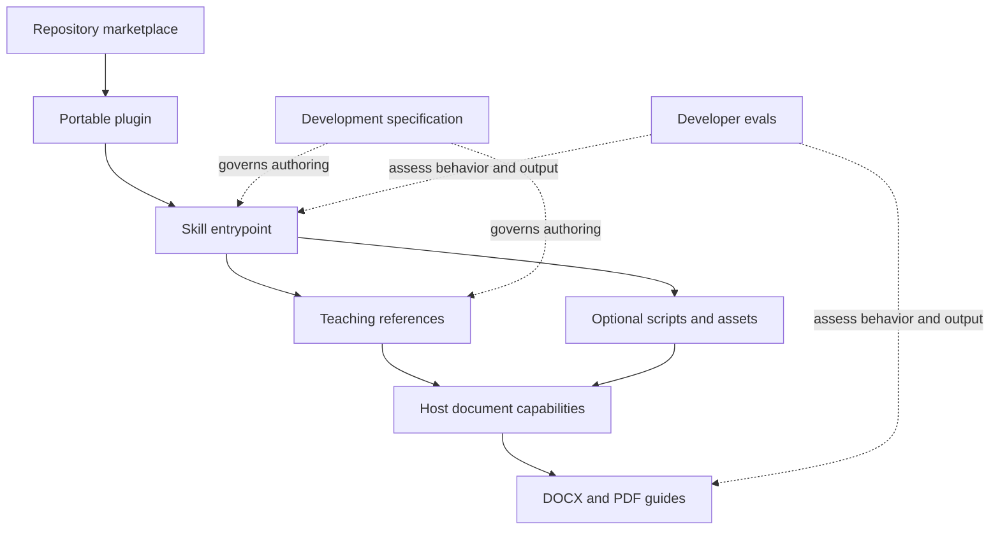

# Repository architecture

## Boundaries

One repository marketplace catalogs independently installable plugins. Each plugin
owns its portable manifest and runtime skill resources. Adding another plugin means
adding `plugins/<plugin-name>/` and a catalog entry, without restructuring this repo.

The document-output arrows describe the mature system, not implemented Phase 1
generators.

| Layer | Location | Responsibility |
| --- | --- | --- |
| Marketplace | `.agents/plugins/marketplace.json` | Discovery, labels, sources, and installation/authentication policies. |
| Plugin | `plugins/cufe-study-guide/plugin.json` | Stable identity, development version, publisher, and host presentation. |
| Skill | `plugins/cufe-study-guide/skills/cufe-study-guide/SKILL.md` | Precise activation description, purpose, essential workflow, and reference routing. |
| References | Skill `references/` | Portable teaching decisions; scaffolds now, operational instructions in Phase 2. |
| Helpers | Skill `scripts/` and `assets/` | Future generation helpers and output resources. Empty directories are retained with `.gitkeep`. |
| Specifications | `docs/specs/` | Development requirements and acceptance criteria; excluded from runtime requirements. |
| Evals | `evals/cufe-study-guide/` | Future developer cases, fixtures, graders, and repair loop; not runtime dependencies. |

Distribute the plugin directory, including its references and future required
helpers. Installation must not need files above that directory. Do not duplicate
the skill under `.agents/skills/` merely to activate it during development.

## Standards verified on 2026-10-01

The current [OpenAI packaging guide](https://developers.openai.com/plugins/build/plugins)
uses root `plugin.json` with the Agent Plugins 1.0.0 schema and discovers root
`skills/` automatically. OpenAI presentation belongs in `extensions.com.openai`.
The `.codex-plugin/plugin.json` scaffold is a supported compatibility fallback;
this project uses the portable format without that duplicate.

The same guide locates repo catalogs at `.agents/plugins/marketplace.json` and
resolves `./` source paths from the marketplace root (this repository), not the
catalog's directory. Our first entry uses `./plugins/cufe-study-guide`,
`AVAILABLE`, and `ON_USE`.

The downloaded [manifest schema](https://agent-plugins.org/schemas/1.0.0/plugin.schema.json)
rejects undeclared root properties and permits omitting `license`. No marketplace
schema URL is declared: the packaging guide supplies the catalog contract, and
the official Codex types and CLI supply additional validation evidence.

The guide supports GitHub shorthand marketplace sources. A future README can
center on `codex plugin marketplace add omar13Hamdy37/OHamdy-agent-skills`.
Phase 4 will test the complete user installation flow.

The authentication enum was checked in official
[Codex marketplace types](https://github.com/openai/codex/blob/d91294c39edb93d204926b33f21310dc968edc34/codex-rs/core-plugins/src/marketplace.rs)
and its generated
[protocol schema](https://github.com/openai/codex/blob/d91294c39edb93d204926b33f21310dc968edc34/codex-rs/app-server-protocol/schema/json/v2/PluginListResponse.json):
only `ON_INSTALL` and `ON_USE` are supported. `ON_USE` defers connection
authentication; this skills-only package declares no service or account to
authenticate. Do not invent `NONE`, `noauth`, or OAuth configuration here.

[OpenAI's skill guidance](https://learn.chatgpt.com/docs/build-skills) requires
`name` and `description`, supports progressive disclosure, and treats scripts,
references, assets, and UI metadata as optional. The entrypoint is authored
manually to avoid unrelated initializer artifacts; `agents/openai.yaml` is not
needed in this phase.

## Host portability and availability

[ChatGPT plugin documentation](https://learn.chatgpt.com/docs/plugins) describes
supported ChatGPT/Work surfaces and Codex CLI plugin browsing; it currently says
plugins are unavailable in the IDE extension. Repository marketplace availability
must be checked per surface. Portable packaging does not establish that every
host can install this repo or produce both formats.

Our design keeps teaching intelligence in instructions and references. Codex can
use local document tools; supported Work environments can use native artifact
capabilities. Later generation helpers must preserve the same learning decisions
and expose unavailable output capabilities honestly.

## Deliberate Phase 1 choices

- No structural change from the requested portable layout was necessary.
- Add `.gitattributes` to enforce LF for tracked text on Windows.
- Keep one catalog for future plugins and leave installation optional.
- Use `0.1.0` as a development version, with explicit scaffold status in listing
  metadata and documentation. There is no release tag or publication.
- Omit license, MCP wiring, hooks, local enablement configuration, final templates,
  dependency manifests, and installer code.
- Keep the v1 specification authoritative during development. Phase 2 must move
  complete operational behavior into references before release, so an installed
  package remains self-contained.
