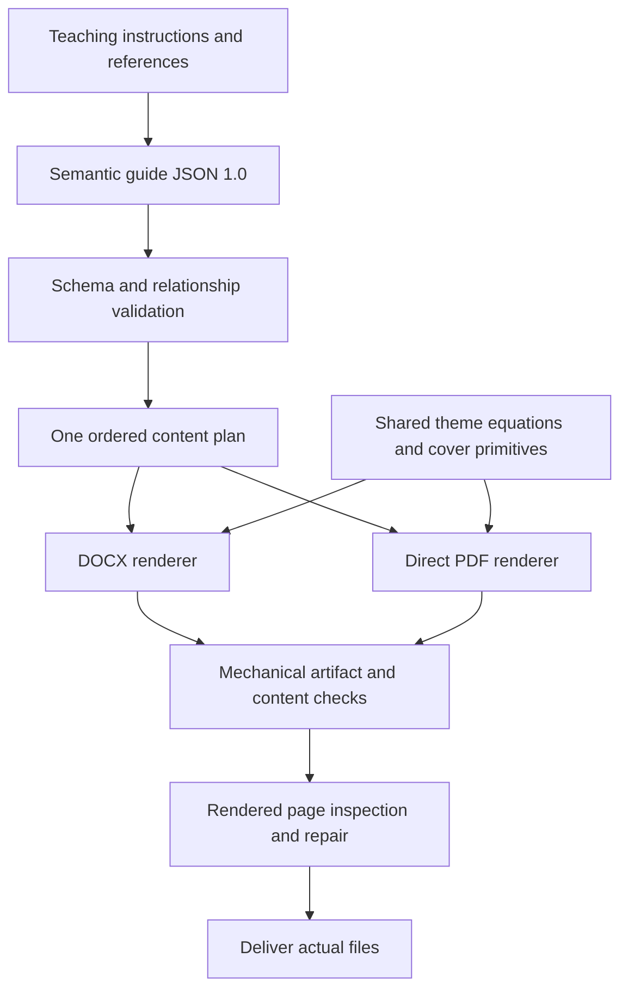

# Study-guide rendering

Phase 3 implements a development baseline for professional DOCX and direct PDF
generation. Phase 4 still owns real CUFE lecture tests, full pedagogical evals,
clean-host release validation, and the final marketplace tutorial.

## Architecture



The JSON Schema is packaged in the skill's `assets/`. One compiler produces both
renderers' ordered events, including labels, optional-proof scope, exercise
feedback, quiz IDs, and Answer Key collection. Renderers never select course
material or generate teaching content. Their independent pagination is allowed;
content drift is not. The runtime needs neither repository `docs/` nor `evals/`.

## Model and authoring

See the packaged [model reference](../plugins/cufe-study-guide/skills/cufe-study-guide/references/guide-model.md)
and [canonical schema](../plugins/cufe-study-guide/skills/cufe-study-guide/assets/study-guide.schema.json).
Metadata is minimal. Provenance is independent of block styling. Fourteen semantic
types and structural prose/list/code/equation/table/image/link blocks are supported.
Nested sections, explicit relationship fields, and unique anchor/question IDs
avoid inferring pedagogy from prose. Unknown input fails clearly.

## Isolated dependency strategy

Python **3.11+** is the baseline. Six direct dependencies have concrete jobs:
`python-docx` authors Word; ReportLab lays out PDF; Matplotlib provides Mathtext
and portable font files; Pillow handles image/cover primitives; `jsonschema`
validates input; `pypdf` inspects generated PDF. Their complete transitive versions
and distribution hashes are committed in `scripts/requirements.lock`; bounded
top-level requirements live in `requirements.in`. No npm installer or service exists.

Official [skill guidance](https://developers.openai.com/plugins/build/skills) allows
deterministic scripts/resources. Current
[dependency guidance](https://developers.openai.com/plugins/deploy/submission-errors)
supports tool dependencies, not automatic Python provisioning. Accordingly the
standard-library `run_renderer.py` creates a venv in the user's cache, installs the
hashed lock once, and invokes the actual renderer. It never changes global Python
or writes inside the installed plugin. Python and its venv/pip facilities must be
available; the bootstrap reports a missing capability or install failure.

Default cache: Windows `%LOCALAPPDATA%/OHamdy-agent-skills/renderer/<fingerprint>`;
else `$XDG_CACHE_HOME` or `~/.cache`. The fingerprint includes lock contents and Python
major/minor. `--runtime-dir` allows an explicit isolated environment. Unrelated
occupied environments are rejected. `--offline` requires an already provisioned
matching runtime and never installs. Once provisioned, generation needs no network
for fonts, icons, artwork, CSS, or math. Initial installation needs a package index
or an appropriate available pip wheel cache. Do not promise first-use offline setup.

## Invocation

Resolve the skill path supplied by the host, then invoke its actual script path.
Do not assume a GitHub checkout or a particular plugin cache location.

```text
python <installed-skill>/scripts/run_renderer.py -- --input <guide.json> --output-dir <user-output-dir> --formats docx,pdf
python <installed-skill>/scripts/run_renderer.py --offline -- --input <guide.json> --output-dir <user-output-dir>
```

An already provisioned Python environment can run `scripts/render_study_guide.py`
directly. Flags include `--validate-only`, `--formats`, `--filename`, `--theme`,
`--overwrite`, `--report`, and `--output-path` for one exact single-format destination.
Use `--setup-only` on the bootstrap to provision without generating documents.

Default destination is `study-guides/` beside input JSON. Input inside an installed
package therefore needs an explicit outside output directory. Filenames use known
course, lecture, and title fields; Windows-invalid characters are sanitized and
the stem is bounded to 120 characters. Existing files require `--overwrite`.
Every requested artifact is staged, checked, then published. Failed publication
restores prior artifacts. The optional report participates in this transaction.
Generated files are ignored under repository `output/`/`outputs/`; ordinary runtime
artifacts belong in user workspaces. Source images resolve from the input directory.

## Visual system

The [academic theme](../plugins/cufe-study-guide/skills/cufe-study-guide/assets/themes/academic.json)
defines a restrained palette. Normal prose is unboxed, 11 pt with approximately
16 pt leading, on white. Headings use black at 21/16/13 pt and descend through six
real heading levels. Code is 9 pt DejaVu Sans Mono; table text is 9.5 pt. Font files
come from Matplotlib's installed distribution, not proprietary repo assets. PDF
content fonts and six unrestricted-embedding DejaVu variants in DOCX are embedded.
Reader behavior can still differ; inspect actual host exports before delivery.

| Meaning | Accent | Non-color treatment |
| --- | --- | --- |
| Normal explanation | `#202B33` | Plain prose and structural hierarchy. |
| Important | `#765719` | Explicit Important label. |
| Common confusion | `#963F38` | Explicit Common Confusion label. |
| Worked example | `#235B78` | Worked Example label and grouped steps. |
| Previous lecture | `#644E7A` | Relationship label and evidenced recap. |
| Under the hood | `#356A67` | Mechanism label. |
| Optional enrichment | `#62626C` | Explicit optional scope. |
| Proof/derivation | `#475B73` | Classification and optional understanding-aid label. |
| Exercise/checkpoint | `#3D6948` | Prompt/feedback or checkpoint labels. |
| Breakpoint | `#52616B` | Compact Good stopping point note, no forced page break. |

Semantic label strips use pale fills, with prose outside boxes; Word adds a small
left rule. Labels preserve grayscale meaning. The grayscale override removes
colored accents. Text contrast was checked using relative luminance against white
and theme fills, informed by W3C guidance on
[color-independent cues](https://www.w3.org/WAI/WCAG22/Understanding/use-of-color.html)
and [text contrast](https://www.w3.org/WAI/WCAG22/Understanding/contrast-minimum.html).
This does not establish full WCAG/PDF accessibility conformance.

A4 is default; Letter is selectable. Margins are 22 mm. The minimal cover has known
course/lecture/title/subtitle only, plus deterministic local nodes, code brackets,
signal curves, circuit traces, or mathematical/geometric motifs according to broad
subject. Unknown subjects get a calm geometric fallback. The cover has no running
header/footer; body numbering starts at 1. Linked contents is automatic for long
guides, selectable explicitly, and needs no Word field update. PDF also has outlines;
DOCX uses true heading styles for its navigation pane.

Short groups stay together where feasible; long proofs/examples paginate rather
than create unbreakable pages. Exercise feedback is separated but nearby. Quiz and
Answer Key start distinct pages in a single column. Cheatsheets stay legible rather
than being forced to one page. Tables wrap, have padded/repeated headers and subtle
rules, and can split long rows. Code preserves source characters with visual wraps.
Equations use shared Mathtext layouts: vector paths in PDF and 600-dpi Word images,
with nearby semantic descriptions, numbers, symbol definitions, and explicit steps.
Images retain aspect ratio, captions, explanations, and Word alt text.

## Validation and development fixture

`dev/rendering/cufe-study-guide/smoke.json` is explicitly synthetic rendering
material. Its intentional 1.5 KB diagram is a source image fixture. Generated
documents/page images are not committed. Run `dev/rendering/check_rendering.py`
with the runtime plus the separate hashed `dev/rendering/requirements.lock`
(`pypdfium2`, development only) to exercise mechanics and render PNGs for inspection.
This is not the Phase 4 pedagogical eval suite.

The renderer checks OOXML ZIP/XML/relationships, heading styles, paper size,
embedded assets, PDF parsing/pages/text/fonts/outlines, supplied external-link
targets, and every expected content item across requested formats. These checks
do not detect all visual defects. Inspect pages and repair output defects before
delivery. See [Phase 3 validation](validation-phase3.md) for actual inspection and
edge-case evidence, rather than treating mechanical success as a visual certificate.

## Known limitations and portability

- Mathtext is a [documented TeX subset](https://matplotlib.org/stable/users/explain/text/mathtext.html),
  not a full LaTeX installation. Unsupported notation fails; oversized equations
  must be split into explicit shorter lines rather than shrunk below 9 pt.
- Word equations are high-resolution graphics with semantic alt/nearby text, not
  editable OMML. PDF equation outlines are sharp but not searchable mathematics.
- PDF is not tagged PDF/UA. Source alt descriptions remain in the model; Word
  figures receive alt text. Full accessibility conformance has not been certified.
- Baseline fonts support common Latin/Greek technical content. Unsupported glyphs
  and complex RTL scripts fail instead of producing incorrect shaping. Labels
  default to English; broader localization needs a capable native output path.
- Code highlighting is not implemented. Word uses discretionary zero-width wrap
  opportunities; exact executable source remains in the semantic model.
- Version 1.0 provides one integrated final quiz/key. It does not automatically
  repair pedagogical content or verify the educational quality of supplied URLs.
- DOCX pagination can vary between readers; embedded fonts do not guarantee identical
  Word/PDF page counts. No Microsoft Word, Adobe Acrobat, or LibreOffice is required
  for baseline generation. Optional DOCX previews need an available safe previewer.
- Windows Python 3.13 was exercised here. Clean Linux/macOS and native Work outputs
  still need Phase 4 host testing. Native generation remains allowed when it preserves
  the same semantic content, visual signals, and output verification obligations.
